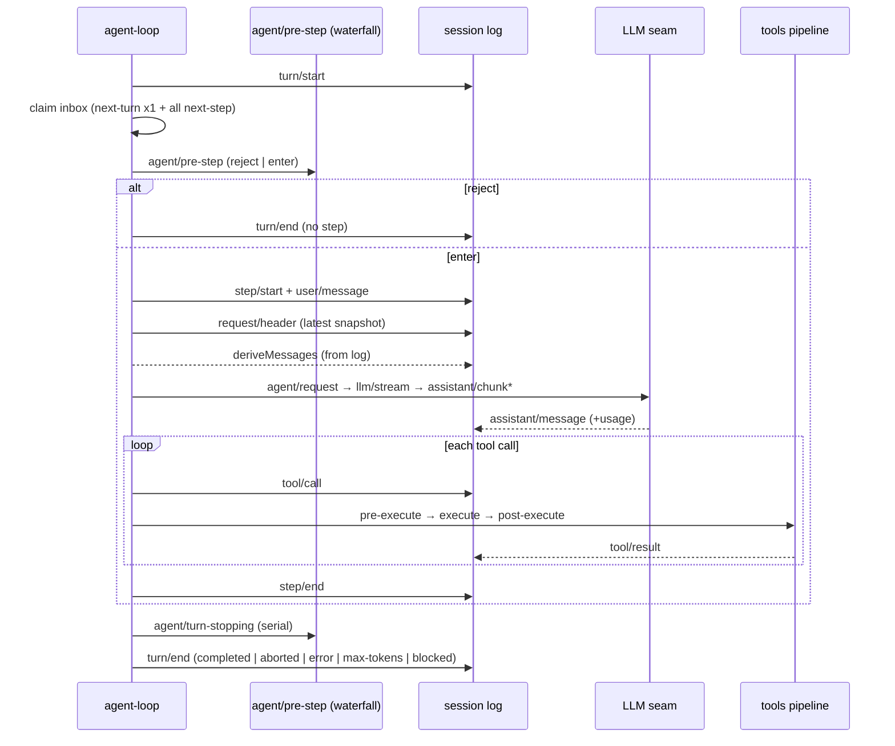

# DeepSeek Harness Architecture — Detailed Design

English | [中文](detailed.zh.md)

This document is the **detailed design** of DeepSeek Harness, recording type contracts, interface signatures, data flows, and extension points subsystem by subsystem. It carries the overall mental model from the [overview design](overview.md) down to "what each seam declares, who implements it, who consumes it"; field-level complete listings live in the repository's existing [subsystem references](../subsystems/README.md) and the [generated event catalog](../event-producer-consumer.md), which this document keeps only the design-relevant points from and links to the owner.

## 1. Core spine, package by package

### 1.1 `core/session` — the event-sourced log

`Session` is the single source of truth: an **append-only** `SessionEvent` log whose message history is derived by `deriveMessages()`, never stored separately. Each event carries a monotonic `seq`, a `time`, and a `data` payload discriminated by `type`; field-level complete declarations and JSDoc for the 13 core variants (`turn/*`, `step/*`, `user/message`, `assistant/*`, `tool/*`, `todo/write`, `request/*`, `session/end-seed`) live in [session.md](../subsystems/session.md).

`SessionEventMap` is merge-extensible: plugins merge new event types with `declare module '@deepseek-ai/dsh-session/types'` without editing the owner package. Events are a discriminated union (`switch (event.type)` narrows `event.data`); `sourceEventSeqs` and `surfaceOp` are **conditional fields** that exist only on the three surface variants (`user/message`, `assistant/message`, `tool/result`) and are enforced by the compiler at `Session.append()`.

The **surface** is the ordered projection: only the three `SurfaceEventType`s may enter it; `append` adds to the tail, and `{ op: 'replace', start, end }` marks a compaction replace node shadowing old nodes. The **ignorable** marker lets a reader that does not recognize a type safely skip a purely informational record; the default is required, so over-refusing is preferred to silently resuming a gutted session. `SESSION_FORMAT_VERSION` is pinned at `0` and bumps only on structural change. `SessionHeader` keeps version, `cwd`, fork lineage (`parentSession`/`seedLength`), and `delegationDepth` as storage metadata **outside** the event log, out of `deriveMessages()`.

### 1.2 `core/agent` — the live Agent and registry

`Agent` is the public handle plugins (UI, hooks, orchestrators) program against; `ctx.agents.get(id)` returns it. The concrete implementation is an internal class of `dsh-agent-loop`; nothing outside the loop depends on it. The complete declaration and each method's JSDoc contract live in [core.md](../subsystems/core.md).

Delivery flows through two ordered pending lists (the **inbox**): `InboxTarget = 'next-turn' | 'next-step'`. `followup` is the next turn's ordinary message, `steer` is the nearest step's steering, and `inject` queues model-facing context without waking. `cancel` clears the queue and aborts the active turn; `cause` is TypeScript-enforced same-process input (`user`/`parent`/`hook`/`disposed`).

`AgentRegistry` (`ctx.agents`) provides creation and ownership: `create()`/`resume()` construct and publish through the registered `AgentFactory`, returning an owner-held `AgentHandle` (with the `dispose()` capability); `register()` records an already-constructed agent. The **initiator scope** is process-local causal attribution: `withInitiator(agent, op)` makes an async chain inherit its initiating Agent, and `withoutInitiator` hides it. Ambient presence is neither liveness proof nor authorization.

The lifecycle status `AgentStatus = 'idle' | 'running'` emits `agent/status` on every transition; `running` describes the driver-wide drain interval, may span several queued turns, and does not prove a turn is still open. `whenIdle()` observes the whole agent's quiescence, following tasks and successor work.

### 1.3 `core/agent-loop` — the default driver

The step-flow waterfall contracts: `agent/pre-step` (the only serial chain) returns `PreStepDecision = { kind: 'reject' } | { kind: 'enter'; messages }`; `agent/request` rewrites the frozen call configuration (config only, never messages); `agent/request-error` runs after a failed step closes and before its turn closes, where a listener returns `{ kind: 'retry' }` without calling `next()` to own recovery; `agent/turn-stopping` is serial with no `next()`. `agent/session-start` carries `SessionStartSource = 'startup' | 'resume' | 'clear' | 'compact'`.

### 1.4 `core/tools` — the tool registry and execution pipeline

`ToolDefinition` is a registered tool: a model-facing `ToolSchema` (name/description/parameters) plus the mandatory `output` declaration, `execute`, and optional `finalizeContent`/`timeoutMs`/`isConcurrencySafe`/`presentCall`/`presentResult`. `schemas()` whitelists only name/description/parameters onto the wire, so callbacks never leak to the model. Complete fields and JSDoc live in [tools.md](../subsystems/tools.md).

`defineTool({ name, description, parameters, output, execute })` validates and narrows arguments with the `ValueSchemaSpec` DSL (string/number/integer/boolean/null/array/object/json/oneOf) and infers the return from `output.schema`. The execution pipeline: `tools/pre-execute` (an allow/deny/ask waterfall) → monotonic guards → `tools/execute` (around-dispatch wrappers, including the timeout policy) → `tools/post-execute` → `finalizeContent` → `tools/result` (the immutable authoritative outcome).

### 1.5 `core/system-prompt` — section assembly

The system prompt is assembled from `PromptSection`s (static, or evaluated per `AssembleContext`, concatenated in ascending `order`; `-100` harness identity, `0` persona, `100–199` tool guidance) under a cooperative waterfall. `PromptContext` is the cache-safe dynamic context logged as a durable user-role snapshot. `ToolProviderResult` exposes this assembly's model-visible schema set and the known-name universe, distinguishing a configured-name typo from a deliberately hidden tool.

### 1.6 `packages/llm` — conversation vocabulary and the adapter seam

A conversation is `Message`s; a message is an array of typed `ContentBlock`s (`text`/`reasoning`/`image`/`tool-call`/`tool-result`, derived from the merge-extensible `ContentBlockMap`). A `Message` is an identified, immutable role/source/content value; assistant messages carry `AssistantProvenance` (provider/model/`replayState`). `MessageSourceMap` describes origin through two independent axes: `kind` (who produced it) and `ContextForm` (`instructions`/`catalog`/`snapshot`/`notice`/`relay`/`recall`, what kind of information it is). `StreamChunk` is the streaming wire protocol; `BlockAssembler` assembles chunks into messages; `LlmAdapter` is the adapter contract every provider implements.

## 2. Cross-cutting type-system patterns

### 2.1 Branded IDs

`Branded<B>` is a type-only string brand; `SessionId` and `CallId` are the two core IDs, and capability packages brand their own (such as `JobId`).

### 2.2 Switch on the discriminant tag

Closed unions end in `assertNever`; merge-extensible unions fall through a documented default.

### 2.3 The `…Map → derived-union` pattern

Five canonical maps:

| Map | Package | Derives |
|---|---|---|
| `ContentBlockMap` | `dsh-llm` | `ContentBlock` |
| `MessageSourceMap` | `dsh-llm` | `MessageSource` |
| `FinishReasonMap` | `dsh-llm` | `FinishReason` |
| `TurnEndReasonMap` | `dsh-session` | `TurnEndReason` |
| `SessionEventMap` | `dsh-session` | `SessionEvent` |

## 3. Representative capability-seam designs

Every seam is a three-role set; this section records the contract through representative seams, with the rest on their owner pages.

### 3.1 `fs` — filesystem

The Service Definition (`ctx.fs`, `dsh-fs`) declares `FsTarget`, read/write/edit outcomes, observed-file state, and `FsErrorCode`. Provider: `dsh-fs-local`. Consumers: the `dsh-tool-fs`/`dsh-tool-fs-search` model tools plus `dsh-fs-observation-policy` (reads/writes/edits require an observed file). It shares subprocess's execution world — pointing it at a remote sandbox moves everything together.

### 3.2 `shell` — Bash execution

The Service Definition (`ctx.shell`, `dsh-shell`) declares the `ShellExecRequest`/`Spec` split: defaulting is an explicit `resolve(request): Spec` step in the owning implementation, never a hidden `?? default` inside `run()`. Provider: `dsh-bash-local`, spawning through `ctx.subprocess`. Consumer: `dsh-tool-bash`.

### 3.3 `subagent` — child agents

The Service Definition (`ctx.subagent`) is a named-provider registry; `SubagentStartRequest`/`Result`/`Run` separate start-time capability from runtime. Providers: `dsh-subagent-spawn-in-process` (spawn, an in-process child context) and `dsh-subagent-fork-in-process` (fork, branching from the parent session). Consumers: the `dsh-tool-subagent`/`dsh-tool-subagent-fork` delegation tools. A child joins its parent's standing composition through `composeFrom`, inheriting the same plugin instances and tool registrations.

### 3.4 `web` — network access

The Service Definition (`ctx.web`, `dsh-web`) declares `WebSearchRequest`/`Result`, `WebFetchRequest`/`Result`/`WebFetchBody`, and `WebError`. Provider: `dsh-web-search-deepseek`. Consumer: `dsh-tool-web`.

### 3.5 `workflow` — batched subagent orchestration

The Service Definition declares `WorkflowStartRequest`/`WorkflowMeta`/`WorkflowRun`/`Result` and the `workflow/*` event payloads. Provider: `dsh-workflow-worker-thread` (a worker-thread engine). Consumers: `dsh-tool-workflow` (the `workflow` tool) and `dsh-tool-ralph` (the `ralph` tool).

## 4. The persistence seam

`SessionPersistence` (`ctx.sessionPersistence`) is the locate/create/append abstraction over the existing `SessionEvent` — **no parallel persisted event type**. `session/event` is a synchronous notification; persistence plugins copy the event into a per-session controller without blocking the producer; a fixed batching window or `session/flush` triggers the durable write. Crash recovery does not truncate: a reload meeting an open `turn/start` closes it with a synthetic `turn/end { reason: { kind: 'interrupted' } }` — `interrupted` is the one `TurnEndReason` the loop never emits.

Two backends: JSONL (a per-session transcript file) and SQLite (one shared database). SQLite uses a monotonic `SCHEMA_VERSION`; `dsh-session` keeps `SESSION_FORMAT_VERSION` pinned at `0`. `SessionHeader` (version/cwd/lineage/seed boundary) is a storage concern, separate from the event log.

## 5. Peripheral capability subsystems

| Subsystem | `ctx` / package | Key contract |
|---|---|---|
| `session-query` | `dsh-session-query` | logical corpus, bounded exact reads, lineage, event relationships, semantic filtering, SQLite full-text search |
| `goal` | same-session goal (`ctx.goals`) | `active`/`paused`/`blocked`/`complete` phases plus a goal-round cap; `blocked` requires a policy code |
| `plan` | `dsh-plan-mode` | log-only `plan/mode` state; the `exit_plan_mode` review arc |
| `preset` | `dsh-agent-presets` | per-session composition: `list`/`resolve`/`mount`/`composeFrom`/`recompose` |
| `jobs` | `ctx.jobs` | branded `JobId`, the producer contract, consumer views, `job_*` control tools |
| `interaction` | approval/interaction | `ApprovalRequest`/`ApprovalOutcome`, `AskUserQuestionRequest`, commands, ask-user tool |
| `sdk` | JSON-RPC | out-of-process runtime SDK: protocol + TS client + server plugin |
| `acp` | automation server | automation-only Agent Client Protocol server |
| `web client/host` | `dsh-client-modules` / `dsh-host-webserver` | `dsh.client` declarations → the `window.__DSH_BOOT__` graph → `/plugins/<id>/client.js` |

The web GUI split: the Node half (`ctx.clientModules`, `ClientModuleRegistry`) scans packages declaring `dsh.client`, composes a `WebBootEntry[]` graph injected as `window.__DSH_BOOT__`, serves each bundle at `/plugins/<id>/client.js`, and taps the index render to inject the boot manifest; the browser half (`ctx.modules`) lazily fetches and materializes those bundles. A page without a valid manifest cannot boot.

## 6. Data flow: the full turn/step sequence

## 7. Grounding constraints cheat-sheet

Extension plugins depend on Service Definitions, never concrete Providers; `dsh-agent-loop` is swappable, and UI/hook/tool plugins use `dsh-agent`. Registrations are effects; a registry's `register()` returns the disposer. Optional services use `ctx.get(name)`; `ctx.<name>` is for declared injections. A new model-visible input must first extend `SessionEventMap`. Waterfall listeners must call `next()`. Opaque cross-boundary ids are branded. One asynchronous operation is expressed with one lifecycle controller or transaction.

This document's authoritative contracts are the source; read the [architecture map](../architecture.md) and the [overview design](overview.md) before changing anything under `packages/`.
