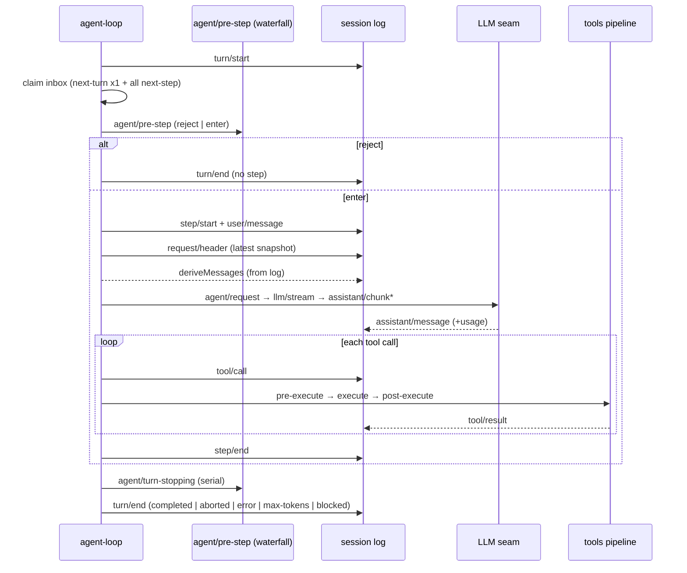

# DeepSeek Harness 架构 —— 详细设计

[English](detailed.md) | 中文

本文是 DeepSeek Harness 的**详细设计**，逐子系统记录类型契约、接口签名、数据流与扩展点。它承接[概要设计](overview.md)的整体心智模型，落到「每个 seam 声明什么、谁实现、谁消费」的层面；字段级完整清单见仓库既有的[子系统参考](../subsystems/README.md)与[生成的事件目录](../event-producer-consumer.md)，本文只保留设计决策所需的要点并链接到 owner。

## 1. 核心 spine 逐包设计

### 1.1 `core/session` —— 事件溯源日志

`Session` 是唯一真相源：一个**只追加**的 `SessionEvent` 日志，消息历史由 `deriveMessages()` 派生，不另存。每个事件携带单调 `seq`、`time` 与按 `type` 判别的 `data` 载荷；13 个核心变体（`turn/*`、`step/*`、`user/message`、`assistant/*`、`tool/*`、`todo/write`、`request/*`、`session/end-seed`）的字段级完整声明与 JSDoc 见 [session.md](../subsystems/session.md)。

`SessionEventMap` 是 merge-extensible 的：插件用 `declare module '@deepseek-ai/dsh-session/types'` 合并新事件类型，不改 owner 包。事件是判别联合（`switch (event.type)` 窄化 `event.data`），`sourceEventSeqs` 与 `surfaceOp` 是**条件字段**，只存在于三个 surface 变体（`user/message`、`assistant/message`、`tool/result`）上，由编译器在 `Session.append()` 处强制。

**surface** 是有序投影：只有三个 `SurfaceEventType` 能上 surface，`append` 加到末尾，`{ op: 'replace', start, end }` 表示压缩用替换节点遮蔽旧节点。**ignorable** 标记让不认识该类型的 reader 可以安全跳过纯信息记录；缺省 required，宁可过度拒绝也不静默恢复一个被掏空的会话。`SESSION_FORMAT_VERSION` 钉在 `0`，只有结构性变化才加一。`SessionHeader` 把版本、`cwd`、fork 血缘（`parentSession`/`seedLength`）、`delegationDepth` 等存储元数据放在事件日志**之外**，不进 `deriveMessages()`。

### 1.2 `core/agent` —— live Agent 与注册表

`Agent` 是插件（UI、hook、编排）编程的公共句柄；`ctx.agents.get(id)` 返回它。具体实现是 `dsh-agent-loop` 的内部类，loop 之外无依赖。完整声明与各方法的 JSDoc 契约见 [core.md](../subsystems/core.md)。

投递经两个有序 pending 列表（**inbox**）：`InboxTarget = 'next-turn' | 'next-step'`。`followup` 是下个 turn 的普通消息，`steer` 是最邻近 step 的 steering，`inject` 注入不唤醒的模型上下文。`cancel` 清队列并中止活动 turn，`cause` 是 TypeScript 强制的同进程输入（`user`/`parent`/`hook`/`disposed`）。

`AgentRegistry`（`ctx.agents`）提供创建与所有权：`create()`/`resume()` 经注册的 `AgentFactory` 构造并发布，返回只被 owner 持有的 `AgentHandle`（含 `dispose()` 能力）；`register()` 记录已构造的 agent。**initiator scope** 是进程内的因果归因：`withInitiator(agent, op)` 让一段异步链继承发起 Agent，`withoutInitiator` 屏蔽它。环境存在既不证明存活也不是授权。

生命周期状态 `AgentStatus = 'idle' | 'running'` 在每次迁移发 `agent/status`；`running` 描述驱动排空区间、可能跨多个排队 turn、不证明某 turn 仍开。`whenIdle()` 观察整个 agent 的静默，追踪任务与后继工作。

### 1.3 `core/agent-loop` —— 默认驱动

step 流程的瀑布契约：`agent/pre-step`（唯一串行监听链）返回 `PreStepDecision = { kind: 'reject' } | { kind: 'enter'; messages }`；`agent/request` 改写冻结的调用配置（只能改 config，不能改 messages）；`agent/request-error` 在失败 step 关闭后、turn 关闭前运行，监听器返回 `{ kind: 'retry' }` 且不调 `next()` 时接管恢复；`agent/turn-stopping` 串行、无 `next()`。`agent/session-start` 携带 `SessionStartSource = 'startup' | 'resume' | 'clear' | 'compact'`。

### 1.4 `core/tools` —— 工具注册表与执行管道

`ToolDefinition` 是一个已注册工具：模型可见 `ToolSchema`（name/description/parameters）+ 强制 `output` 声明 + `execute` + 可选 `finalizeContent`/`timeoutMs`/`isConcurrencySafe`/`presentCall`/`presentResult`。`schemas()` 用白名单只投影 name/description/parameters 上 wire，保证回调永不泄漏给模型。完整字段与 JSDoc 见 [tools.md](../subsystems/tools.md)。

`defineTool({ name, description, parameters, output, execute })` 用 `ValueSchemaSpec`（string/number/integer/boolean/null/array/object/json/oneOf）DSL 验证并窄化参数，从 `output.schema` 推出返回类型。执行管道：`tools/pre-execute`（allow/deny/ask 瀑布）→ 单调守卫 → `tools/execute`（around-dispatch 包装，含超时策略）→ `tools/post-execute` → `finalizeContent` → `tools/result`（不可变权威结果）。

### 1.5 `core/system-prompt` —— 分节组装

系统提示词由 `PromptSection`（静态或按 `AssembleContext` 求值，按 `order` 升序拼接；`-100` harness 身份、`0` persona、`100–199` 工具指引）与合作式瀑布组装。`PromptContext` 是缓存安全的动态上下文，作为持久 user-role 快照落日志。`ToolProviderResult` 暴露本次装配的模型可见 schema 集与已知名全集，用于区分「配置名写错」与「本 scope 刻意隐藏」。

### 1.6 `packages/llm` —— 对话词汇与适配器 seam

对话是 `Message`，消息是类型化 `ContentBlock` 数组（`text`/`reasoning`/`image`/`tool-call`/`tool-result`，由 merge-extensible `ContentBlockMap` 派生）。`Message` 是标识、不可变的 role/source/content 值；assistant 消息带 `AssistantProvenance`（provider/model/`replayState`）。`MessageSourceMap` 通过 `kind`（谁产出）与 `ContextForm`（`instructions`/`catalog`/`snapshot`/`notice`/`relay`/`recall`，是什么信息）两条独立轴刻画来源。`StreamChunk` 是流式 wire 协议；`BlockAssembler` 把 chunks 组装成消息；`LlmAdapter` 是每个 provider 必须实现的适配器契约。

## 2. 类型系统的贯穿模式

### 2.1 品牌 ID

`Branded<B>` 是只含类型信息的字符串品牌；`SessionId` 与 `CallId` 是两个核心 ID，能力包各自品牌自己的（如 `JobId`）。

### 2.2 判别标签 switch

封闭联合用 `assertNever` 收尾，merge-extensible 联合落到一个有文档的 default。

### 2.3 The `…Map → derived-union` pattern

五个典型 map：

| Map | 包 | 派生 |
|---|---|---|
| `ContentBlockMap` | `dsh-llm` | `ContentBlock` |
| `MessageSourceMap` | `dsh-llm` | `MessageSource` |
| `FinishReasonMap` | `dsh-llm` | `FinishReason` |
| `TurnEndReasonMap` | `dsh-session` | `TurnEndReason` |
| `SessionEventMap` | `dsh-session` | `SessionEvent` |

## 3. 能力 seam 的代表设计

每个 seam 都是三件套；此处以代表性 seam 记录契约，其余见 owner 页。

### 3.1 `fs` —— 文件系统

Service Definition（`ctx.fs`，`dsh-fs`）声明 `FsTarget` 与 read/write/edit 结果、observed-file 状态、`FsErrorCode`。Provider：`dsh-fs-local`。Consumer：`dsh-tool-fs`/`dsh-tool-fs-search` 模型工具 + `dsh-fs-observation-policy`（读/写/编辑需先观察文件）。它共享 subprocess 的执行世界——指向远程沙箱即整体搬走。

### 3.2 `shell` —— Bash 执行

Service Definition（`ctx.shell`，`dsh-shell`）声明 `ShellExecRequest`/`Spec` 分离：默认解析是 owner 实现里的显式 `resolve(request): Spec`，而非 `run()` 内隐式 `?? default`。Provider：`dsh-bash-local` 经 `ctx.subprocess` 派生。Consumer：`dsh-tool-bash`。

### 3.3 `subagent` —— 子 Agent

Service Definition（`ctx.subagent`）是命名 Provider 注册表；`SubagentStartRequest`/`Result`/`Run` 把启动时能力与运行时分离开。Provider：`dsh-subagent-spawn-in-process`（spawn，进程内子上下文）与 `dsh-subagent-fork-in-process`（fork，从父会话分叉）。Consumer：`dsh-tool-subagent`/`dsh-tool-subagent-fork` 委托工具。child 经 `composeFrom` 加入父的 standing composition，继承同一插件实例与工具注册。

### 3.4 `web` —— 网络访问

Service Definition（`ctx.web`，`dsh-web`）声明 `WebSearchRequest`/`Result`、`WebFetchRequest`/`Result`/`WebFetchBody` 与 `WebError`。Provider：`dsh-web-search-deepseek`。Consumer：`dsh-tool-web`。

### 3.5 `workflow` —— 批量子代理编排

Service Definition 声明 `WorkflowStartRequest`/`WorkflowMeta`/`WorkflowRun`/`Result` 与 `workflow/*` 事件载荷。Provider：`dsh-workflow-worker-thread`（worker 线程引擎）。Consumer：`dsh-tool-workflow`（`workflow` 工具）与 `dsh-tool-ralph`（`ralph` 工具）。

## 4. 持久化 seam

`SessionPersistence`（`ctx.sessionPersistence`）是对既有 `SessionEvent` 的 locate/create/append 抽象——**不引入并行持久化事件类型**。`session/event` 是同步通知，持久化插件拷贝进 per-session 控制器而不阻塞生产者；固定批窗口到期或 `session/flush` 触发持久写。crash 恢复不截断：reload 遇到开着的 `turn/start` 时闭合合成 `turn/end { reason: { kind: 'interrupted' } }`——`interrupted` 是唯一 loop 从不发出的 `TurnEndReason`。

两个后端：JSONL（每会话独立 transcript 文件）与 SQLite（共享单库）。SQLite 用单调 `SCHEMA_VERSION`；`dsh-session` 把 `SESSION_FORMAT_VERSION` 钉在 `0`。`SessionHeader`（版本/cwd/血缘/种子边界）是存储关注点，与事件日志分离。

## 5. 外围能力子系统

| 子系统 | `ctx` / 包 | 关键契约 |
|---|---|---|
| `session-query` | `dsh-session-query` | 逻辑语料、有界精确读取、血缘、事件关系、语义过滤、SQLite 全文搜索 |
| `goal` | 同会话目标（`ctx.goals`） | `active`/`paused`/`blocked`/`complete` 相位 + goal-round 上限；`blocked` 需策略码 |
| `plan` | `dsh-plan-mode` | log-only `plan/mode` 状态；`exit_plan_mode` 评审弧 |
| `preset` | `dsh-agent-presets` | per-session 组合：`list`/`resolve`/`mount`/`composeFrom`/`recompose` |
| `jobs` | `ctx.jobs` | 品牌 `JobId`、生产者契约、消费者视图、`job_*` 控制工具 |
| `interaction` | 审批/交互 | `ApprovalRequest`/`ApprovalOutcome`、`AskUserQuestionRequest`、命令、ask-user 工具 |
| `sdk` | JSON-RPC | 进程外运行时 SDK：协议 + TS client + server 插件 |
| `acp` | 自动化 server | 只用于自动化的 Agent Client Protocol server |
| `web client/host` | `dsh-client-modules` / `dsh-host-webserver` | `dsh.client` 声明 → `window.__DSH_BOOT__` 图 → `/plugins/<id>/client.js` |

web GUI 拆分：Node 半（`ctx.clientModules`，`ClientModuleRegistry`）扫描声明 `dsh.client` 的包，组成 `WebBootEntry[]` 图注入 `window.__DSH_BOOT__`，为每个 bundle 提供 `/plugins/<id>/client.js` 路由，并 tap index 渲染注入 boot manifest；浏览器半（`ctx.modules`）惰性拉取并物化这些 bundle。缺有效 manifest 的页面不能 boot。

## 6. 数据流：turn/step 全时序

## 7. 落地约束速查

扩展插件依赖 Service Definition，绝不依赖具体 Provider；`dsh-agent-loop` 可替换，UI/hook/tool 插件用 `dsh-agent`。注册是效果，注册表 `register()` 返回 disposer。可选服务用 `ctx.get(name)`，`ctx.<name>` 留给已声明的注入。新模型可见输入必须先扩 `SessionEventMap`。瀑布监听器必须调 `next()`。跨边界 opaque id 品牌化。同一异步操作用一个生命周期控制器或事务表达。

本文的权威契约以源码为准；改 `packages/` 前先读[架构图](../architecture.md)与[概要设计](overview.md)。
