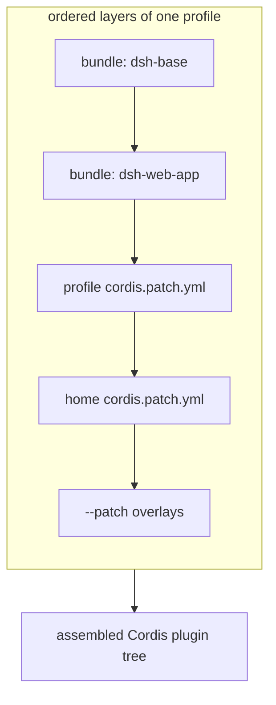
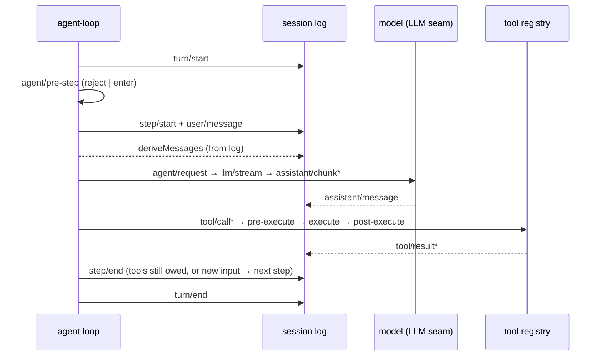

# DeepSeek Harness Architecture — Overview Design

English | [中文](overview.zh.md)

This document is the **overview design** of DeepSeek Harness, answering three questions: which parts the system consists of, where each part's responsibility boundary lies, and how data flows through it. It is for readers who want the whole mental model on one page; type-level contracts, interface signatures, and per-subsystem field semantics live in the sibling [detailed design](detailed.md). It does not replace the repository's existing [architecture map](../architecture.md) (the behavior map) or the [subsystem references](../subsystems/README.md) (the type dictionary) — this directory is the design survey above that map; the three serve distinct jobs.

## 1. Positioning and overall shape

DeepSeek Harness is a **plugin-based agent runtime framework** built on a vendored Cordis. Its central claim in one sentence: **everything is a plugin** — the model adapter, the tool registry, the session log, the approval policy, and even the agent loop itself are plugins replaceable from configuration; there is no privileged core to patch.

A running `dsh` process is a plugin tree assembled **at boot** from several ordered layers. Extension changes no code: it mounts a plugin beside the others, and registration is an effect (`ctx.effect()` / `ctx.on()` / `ctx.waterfall()`) that unwinds on unload. This principle runs through the whole document — it determines the composition mechanism, the capability seams, and the event system below.

### 1.1 Three-layer shape

| Layer | Responsibility | Key terms |
|---|---|---|
| Composition | Assembles the plugin tree from declarative layers | profile, bundle, patch, `cordis.yml` |
| Product spine | Session, prompt, tools, Agent, loop | `ctx.sessions`, `ctx.systemPrompt`, `ctx.tools`, `ctx.agents`, `ctx.agentLoop` |
| Capability seam | Swappable capabilities and their model-facing tools | Service Definition / Provider / Consumer |

The spine is the backbone of the product API: it defines what a session is, what a tool is, and how an Agent is driven, and it provides the concrete implementation of the default loop. Capability seams sit above the spine, providing filesystem, shell, subagent, and web capabilities by "swap one Provider, swap the whole product".

## 2. Composition: profiles and bundles

A running `dsh` is a plugin tree assembled at boot from ordered layers; the assembly units are **profiles** and **bundles**.

A **profile** is a named composition stored in the Harness home: it lists the bundles it stacks, records which out-of-tree plugins it installed, and keeps the user's own `cordis.patch.yml`. `web` and `headless` ship as templates; `tui` and `cc-tui` are out-of-tree profiles users create through `dsh plugin`.

A **bundle** is the **distribution format** for Cordis config rows and the code they mount, so what it inserts stays patchable by layers above. Each package declares its identity in its `package.json` `dsh` field: `dsh.profile` lists a profile's bundles, and `dsh.bundle` points at a bundle's patch file.

Layers apply in this order to an empty entry list: each bundle in the profile's declared order → the profile's own `cordis.patch.yml` → the home-level `$DSH_HOME/cordis.patch.yml` → command-line `--patch` overlays. A patch targets a row by `id` and **replaces its whole config**, or inserts new rows. `dsh-base` is the first layer of every profile (model adapters, tools, persistence, sandbox and approval policy, settings, credentials, telemetry); `dsh-web-app` adds the browser application, and `dsh-headless` adds a one-shot runner.

Any row that `dsh --profile <name> --dump-config` prints can be replaced by a user patch — the operable expression of "no privileged core" on the user side.

## 3. Product spine: core packages and the LLM vocabulary

The spine is the six packages under `packages/core` plus the conversation vocabulary of `packages/llm`. One model turn flows through them in order: `agent-loop` claims queued input → opens a turn on the session log → `system-prompt` assembles the request prefix and derives history from the log → streams the model response through the LLM seam → dispatches tool calls through the tool registry → appends every model-visible fact back to the log for the next step to derive from.

| Package | Owns | `ctx` key |
|---|---|---|
| `core/session` | The append-only `SessionEvent` log and in-memory store (the single source of truth) | `ctx.sessions` |
| `core/system-prompt` | Prompt-section and tool-schema assembly | `ctx.systemPrompt` |
| `core/tools` | The scoped tool registry and guarded execution pipeline | `ctx.tools` |
| `core/agent` | The `Agent` interface, live registry, `agent/*` events | `ctx.agents` |
| `core/agent-loop` | The default driver implementing that interface | `ctx.agentLoop` |
| `core/scope` | The per-agent scoped-registration primitive | library, no key |
| `llm/llm` | Message and stream vocabulary plus the adapter seam | `ctx.llm` |

`core/scope` is the one non-service package: a dependency-free library (`createScope`/`scopeOf`/`scopeTarget`) that sits below `session` and `system-prompt` in the graph precisely so they can consume it without a cycle. `agent-loop` is the one concrete implementation of the `Agent` contract; extension plugins depend on `agent` rather than `agent-loop`, so the loop stays swappable.

### 3.1 The session log is the single source of truth

A `Session` is an **append-only** log of typed `SessionEvent`s. The context the model sees is derived entirely from it — there is no separately stored message history: `deriveMessages()` projects message history from the log, raw `assistant/chunk` events preserve token-level replay fidelity, and fork/resume/transcript/telemetry/persistence all derive from this stream.

**Model-visible means logged** is a runtime-asserted invariant: anything that reaches a model request must be reconstructable from the log. This is why a new model-visible input must first extend `SessionEventMap` with a new session event, rather than being spliced directly into the request.

### 3.2 Two cross-cutting type-system patterns

Nearly every extensible sum type follows the **`…Map → derived-union`** pattern: an interface keyed by a discriminant tag (the `…Map`) from which the union is derived with `keyof`; plugins add variants by **declaration merging** without editing the owner package. The five canonical maps are listed in [detailed design §2.3](detailed.md#23-the-map--derived-union-pattern).

IDs passed across packages are **branded** (`Branded<B>`): structurally strings but non-interchangeable at the type level — a `SessionId` cannot be passed where a `CallId` is expected. The `Branded<B>` primitive lives in the type-only `dsh-brand` package with no runtime code, so any package can brand its own ids without depending on an unrelated capability package.

## 4. Event system: three kinds of events

Choosing the right event domain is the first decision in most changes.

- **Session events**: durable facts appended to the log and broadcast through `session/event`. Use one when the fact must survive a reload.
- **Agent events** (`agent/*`): carry a live `Agent` — inbox, step, status, request, validation, continuation. Use them to observe or intercept work in flight.
- **Capability events**: attach policy and adapters to a seam (`fs/*`, `tools/*`, `telemetry/*`) without importing the loop.

`turn/*`, `step/*`, `user/message`, `assistant/*`, and `tool/*` are durable session events; the rest are live extension points across the three domains. `agent/pre-step`, `agent/request`, `llm/stream`, and the three `tools/*` are waterfalls whose listeners **must call `next()`** to delegate; `agent/turn-stopping` is serial with no `next()`.

## 5. Capability seams: swappable capabilities

A **seam** is a swappable capability with three roles: a **Service Definition** (the abstract service declaring the `ctx` service and vocabulary types); one or more **Service Providers** (implementing it); one or more **Consumers** (using it, commonly a model-facing tool). A package may combine roles, but one role alone is not a seam; adding a capability means designing all three together.

Seams are why swapping one Provider swaps the whole product: filesystem and subprocess Providers share one execution world, so pointing them at a remote sandbox moves Bash, PTY, and LSP together with no Provider forks. Subagent Providers vary just as widely behind one interface — from a fresh child agent to a delegated turn in another product.

## 6. Session lifecycle: turns and steps

A **step** is one model request plus the tool calls it requested; a **turn** is zero or more steps — opened before the first input is claimed, closed once nothing is owed.

Input reaches the driver through one inbox: some messages wake it immediately; injected context waits in the inbox until another message does. `agent/pre-step` decides what the model sees; listeners may rewrite the claimed messages or reject them outright. A rejected or empty first claim still closes a durable turn that spent no step, so the log records the attempt.

## 7. Delivery and build

The repository is a pnpm workspace (ESM everywhere) under one npm scope, `@deepseek-ai/dsh-*`. `apps/cli` exports the `dsh` command (`dsh --profile <name>`, `dsh plugin`, the `dsh web` alias); the build runs `tsc` for types and `tsdown` for runtime code, with host and client built as two separate faces. Source launch runs through `node --import tsx/esm`, and types compile under `strict: true`. The Python SDK and the vendored Cordis source form the repository's other two wings but sit outside this design survey.

## 8. Next steps

Type-level contracts, interface signatures, and per-subsystem field semantics for the capability subsystems are in the [detailed design](detailed.md). Read the [architecture map](../architecture.md) and this document before changing anything under `packages/`.
