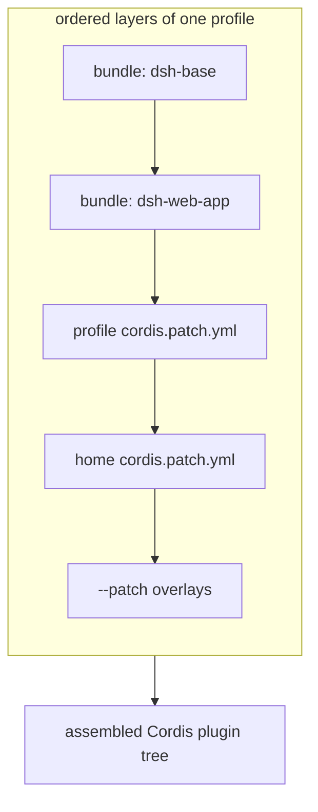
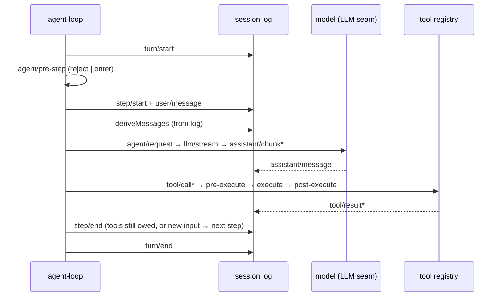

# DeepSeek Harness 架构 —— 概要设计

[English](overview.md) | 中文

本文是 DeepSeek Harness 的**概要设计**，回答「这个系统由哪些部分构成、各部分的职责边界、数据如何流过」三个问题。它面向想在一页内建立整体心智模型的读者；类型级契约、接口签名和各子系统的逐字段语义见同目录的[详细设计](detailed.md)。它不替代仓库既有的[架构图](../architecture.md)（行为地图）与[子系统参考](../subsystems/README.md)（类型字典）——本目录是那份地图之上的设计综述，三者各司其职。

## 1. 定位与总体形态

DeepSeek Harness 是一个**插件化的 Agent 运行框架**，建立在 vendored 版本的 Cordis 之上。它的核心主张一句话：**一切都是插件**——模型适配器、工具注册表、会话日志、审批策略乃至 Agent 主循环本身，都是从配置可替换的插件，不存在需要打补丁的特权核心。

一个运行中的 `dsh` 进程是一棵在**启动时**从若干有序层拼装出来的插件树。扩展的途径不是改代码，而是把新插件挂在别的插件旁边：注册是副作用（`ctx.effect()` / `ctx.on()` / `ctx.waterfall()`），插件卸载时自动回滚。这条原则贯穿全文——它决定了下面的组合机制、能力 seam 与事件体系。

### 1.1 三层形态

| 层 | 职责 | 关键术语 |
|---|---|---|
| 组合层 | 把插件树从声明式层拼出来 | profile、bundle、patch、`cordis.yml` |
| 产品 spine | 会话、提示词、工具、Agent、主循环 | `ctx.sessions`、`ctx.systemPrompt`、`ctx.tools`、`ctx.agents`、`ctx.agentLoop` |
| 能力 seam | 可替换能力及其模型可见工具 | Service Definition / Provider / Consumer |

spine 是产品 API 的脊梁：它定义了「什么是会话、什么是工具、Agent 如何被驱动」，并给出默认主循环的具体实现。能力 seam 挂在 spine 之上，用「换一个 Provider 就换掉整个产品」的方式提供文件系统、Shell、子 Agent、Web 等能力。

## 2. 组合机制：profile 与 bundle

运行的 `dsh` 是启动时从有序层拼出的插件树，拼装单位是 **profile** 与 **bundle**。

**profile** 是存于 Harness home 的命名组合：它列出自己堆叠的 bundle、记录装过哪些树外插件、并保留用户自己的 `cordis.patch.yml`。`web` 与 `headless` 作为模板随包发布；`tui`、`cc-tui` 等是用户通过 `dsh plugin` 创建的树外 profile。

**bundle** 是 Cordis 配置行与其挂载代码的**分发格式**，使其插入的内容仍能被上层 patch。每个 package 在自己的 `package.json` 里用 `dsh` 字段声明身份：`dsh.profile` 列出一个 profile 的 bundles，`dsh.bundle` 指向 bundle 的 patch 文件。

各层按此顺序作用于一个空的入口列表：profile 按声明顺序逐 bundle 应用 → profile 自身的 `cordis.patch.yml` → home 级 `$DSH_HOME/cordis.patch.yml` → 命令行 `--patch` 覆盖。patch 按 `id` 定位一行并**整体替换**其 config，或插入新行。`dsh-base` 是每个 profile 的第一层（模型适配器、工具、持久化、沙箱与审批策略、设置、凭据、遥测）；`dsh-web-app` 加浏览器应用，`dsh-headless` 加一次性 runner。

任何 `dsh --profile <name> --dump-config` 打印出来的行都可以被用户自己的 patch 替换——这是「无特权核心」在用户侧的可操作表达。

## 3. 产品 spine：核心包与 LLM 词汇

spine 由 `packages/core` 的六个包 + `packages/llm` 的对话词汇构成。一次模型回合依序流经它们：`agent-loop` 认领排队输入 → 在会话日志上打开一个 turn → `system-prompt` 组装请求前缀、从日志派生历史 → 经 LLM seam 流式取模型响应 → 经工具注册表派发工具调用 → 把每一条模型可见事实追加回日志，供下一步派生。

| 包 | 职责 | `ctx` key |
|---|---|---|
| `core/session` | 只追加的 `SessionEvent` 日志 + 内存 store（唯一真相源） | `ctx.sessions` |
| `core/system-prompt` | 提示词分节与工具 schema 组装 | `ctx.systemPrompt` |
| `core/tools` | 作用域工具注册表与受保护的执行管道 | `ctx.tools` |
| `core/agent` | `Agent` 接口、live 注册表、`agent/*` 事件 | `ctx.agents` |
| `core/agent-loop` | 实现该接口的默认驱动 | `ctx.agentLoop` |
| `core/scope` | 每-Agent 作用域注册原语 | 库，无 key |
| `llm/llm` | 消息与流词汇，以及适配器 seam | `ctx.llm` |

其中 `core/scope` 是唯一的非服务包：一个无依赖的库（`createScope`/`scopeOf`/`scopeTarget`），恰好位于 `session` 与 `system-prompt` 的图下方，让它们消费它而不成环。`agent-loop` 是 `Agent` 契约的唯一具体实现，扩展插件依赖 `agent` 而非 `agent-loop`，从而主循环保持可替换。

### 3.1 会话日志是唯一真相源

`Session` 是一个**只追加**的类型化 `SessionEvent` 日志。模型看到的上下文全部由它派生——不存在另外存储的消息历史：`deriveMessages()` 从日志投射消息历史，原始 `assistant/chunk` 事件保留 token 级回放保真度，fork/resume/转写/遥测/持久化也都由这条流派生。

**模型可见 ⟺ 已记录**是一条运行时断言的不变量：任何到达模型请求的内容都必须能从日志重建。这就是为什么新增一个模型可见输入必须先扩展 `SessionEventMap` 并新增一个 session 事件，而不是直接拼进请求。

### 3.2 类型系统的两条贯穿模式

几乎每个可扩展联合类型都遵循 **`…Map → derived-union`** 模式：一个以判别标签为 key 的接口（`…Map`），联合类型由它用 `keyof` 派生；插件通过**声明合并**加新变体而无需改 owner 包。五个典型 map 见[详细设计 §2.3](detailed.md#23-the-map--derived-union-pattern)。

跨包传递的 ID 都是**品牌化**的（`Branded<B>`）：结构上是字符串，类型层面不可互换——`SessionId` 不能被当作 `CallId` 传。`Branded<B>` 原语住在类型专用的 `dsh-brand` 包，无任何运行时代码，任何包都能品牌自己的 ID 而不依赖无关能力包。

## 4. 事件体系：三类事件

选对事件域是大多数改动的第一决策。

- **Session 事件**：追加到日志、经 `session/event` 广播的持久事实。需要跨 reload 存活的用它。
- **Agent 事件**（`agent/*`）：携带 live `Agent`——inbox、step、status、request、validation、continuation。用在途观察与拦截。
- **Capability 事件**：把策略与适配器挂到 seam（`fs/*`、`tools/*`、`telemetry/*`），无需 import 主循环。

`turn/*`、`step/*`、`user/message`、`assistant/*`、`tool/*` 是持久会话事件；其余是跨三个域的 live 扩展点。`agent/pre-step`、`agent/request`、`llm/stream` 与三个 `tools/*` 是瀑布，监听器**必须调用 `next()`** 才能委托；`agent/turn-stopping` 是串行的、无 `next()`。

## 5. 能力 seam：可替换能力

**seam** 是一个可交换能力，含三个角色：**Service Definition**（声明 `ctx` 服务与词汇类型的抽象服务）；一个或多个 **Service Provider**（实现它）；一个或多个 **Consumer**（消费它，通常是模型可见工具）。一个包可以兼任多角色，但单一角色不构成 seam；新增能力意味着三件套一起设计。

seam 是「换一个 Provider 就换掉整个产品」的原因：文件系统与 subprocess Provider 共享同一套执行世界，把它们指向远程沙箱，Bash、PTY、LSP 就一起移动，无需 Provider 分叉。subagent Provider 同样在单一接口背后变化极大——从新子 Agent 到另一产品里的委托回合。

## 6. 会话生命周期：turn 与 step

**step** 是一次模型请求加上它请求的工具调用；**turn** 是零或多个 step——在首个输入被认领前打开，无事可欠时关闭。

输入经统一的 inbox 到达驱动：一些消息立刻唤醒它，注入的上下文在 inbox 里等到别的消息唤醒它。`agent/pre-step` 决定模型看到什么，监听器可改写认领的消息或直接拒绝；被拒绝或为空的首次认领仍会关闭一个未消耗任何 step 的持久 turn，让日志记录下这次尝试。

## 7. 交付与构建

仓库是 pnpm workspace（ESM everywhere），npm scope 统一为 `@deepseek-ai/dsh-*`。`apps/cli` 导出 `dsh` 命令（`dsh --profile <name>`、`dsh plugin`、`dsh web` 别名）；构建走 `tsc` 产类型 + `tsdown` 打包运行时代码，host 与 client 两个平面分开构建。源码启动经 `node --import tsx/esm`，类型在 `strict: true` 下编译。Python SDK 与 vendored Cordis 源码构成仓库的其余两翼，但不在本设计综述范围内。

## 8. 下一步

类型级契约、接口签名与外围能力子系统的逐字段语义见[详细设计](detailed.md)。任一步的改动都应在 `packages/` 前先读[架构图](../architecture.md)与本文件。
